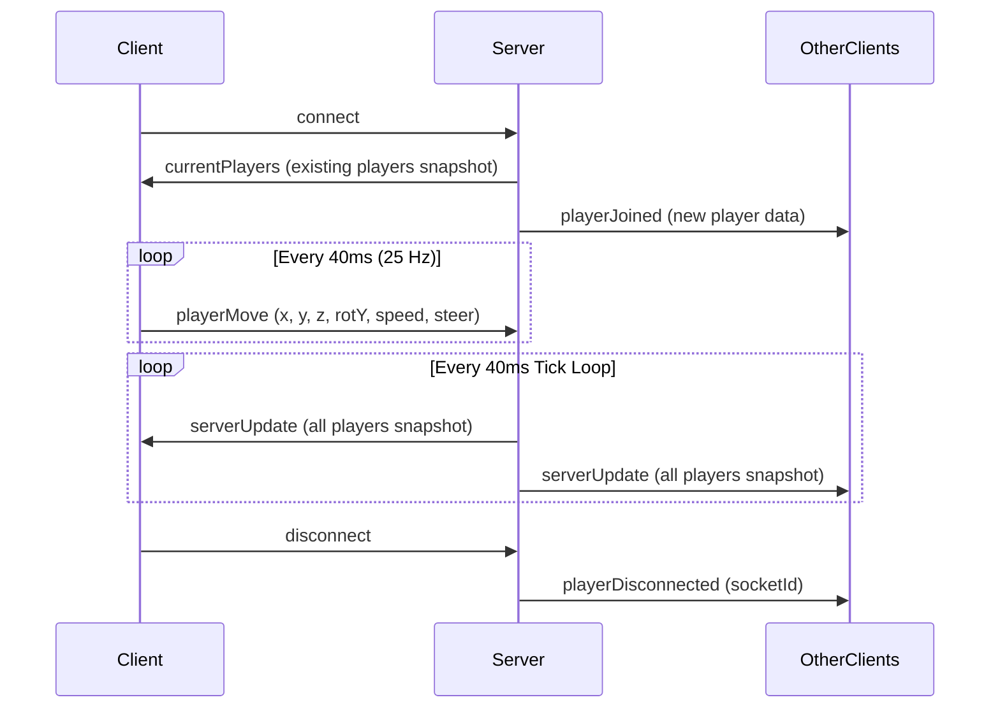

# 🌐 CyberCity Real-Time Multiplayer Server

This directory contains the Node.js backend powering the multiplayer state synchronization and production static serving for the **CyberCity 3D WebGL Portfolio**.

---

## 🏗️ Architecture Overview

```
server/
├── README.md       # Server documentation
└── server.js       # Express HTTP server & Socket.io real-time engine
```

The server has two primary responsibilities:
1. **Production Static Hosting**: Serves the compiled Vite production assets (`/dist`) with fallback routing for single-page application (SPA) paths.
2. **Real-Time Telemetry Synchronization**: Manages connected pilots, distributes spawn points, validates movement packets, and broadcasts world state at a fixed 25 Hz tick rate.

---

## 🔌 Socket.io Event Pipeline



### Event Specifications

| Event Name | Direction | Payload | Description |
| :--- | :--- | :--- | :--- |
| `currentPlayers` | Server $\rightarrow$ Client | `{ yourId, players: { [id]: PlayerData } }` | Initial state sent to newly connected client |
| `playerJoined` | Server $\rightarrow$ Others | `PlayerData` | Broadcast when a new pilot enters the city |
| `playerMove` | Client $\rightarrow$ Server | `{ x, y, z, rotY, speed, steer }` | Client telemetry packet throttled to 25 Hz |
| `serverUpdate` | Server $\rightarrow$ All | `{ [id]: { x, y, z, rotY, speed, steer } }` | Authoritative world position snapshot |
| `playerDisconnected` | Server $\rightarrow$ Others | `socketId` | Broadcast when a player leaves |

---

## ⚡ Performance & Throttling

- **Fixed 25 Hz Tick Loop**: State broadcasts are capped at 25 Hz (`1000ms / 25 = 40ms`), preventing CPU and network saturation.
- **Spawn Staggering**: Pre-configured spawn points prevent vehicles from colliding or overlapping upon entering the city:
  ```javascript
  const SPAWN_POINTS = [
    { x: 0, y: 0.35, z: 0, rotY: 0 },
    { x: 3.5, y: 0.35, z: -2.0, rotY: 0.2 },
    { x: -3.5, y: 0.35, z: -2.0, rotY: -0.2 },
    { x: 0, y: 0.35, z: -4.5, rotY: 0 }
  ];
  ```
- **Automated Color Rotation**: Automatically assigns distinctive neon colors to each pilot (`Cyber Cyan`, `Sunset Coral`, `Neon Mint`, `Solar Flare`, `Vapor Violet`).
- **Health Check Endpoint**: Accessible at `GET /api/health` returning server status, active player count, and timestamp.

---

## 🚀 Running the Server

### Development
```bash
node server/server.js
# Runs standalone on port 3001
```

### Production
```bash
NODE_ENV=production PORT=3001 node server/server.js
```

---

## ☁️ Deployment Guide

The server can be deployed on any Node.js container or cloud runtime:

- **Render / Railway / Fly.io**: Set start command to `npm start` and build command to `npm install && npm run build`.
- **Docker**:
  ```dockerfile
  FROM node:20-alpine
  WORKDIR /app
  COPY package*.json ./
  RUN npm ci
  COPY . .
  RUN npm run build
  EXPOSE 3001
  CMD ["node", "server/server.js"]
  ```
